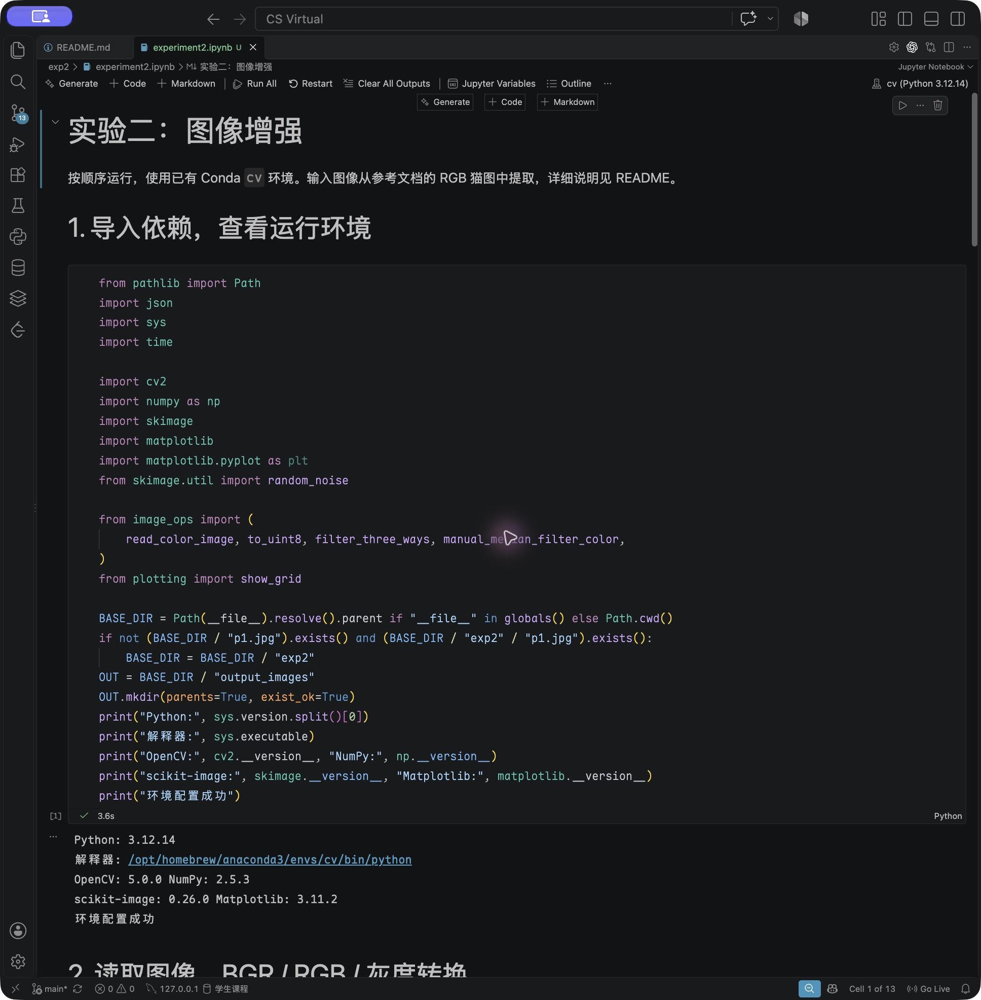
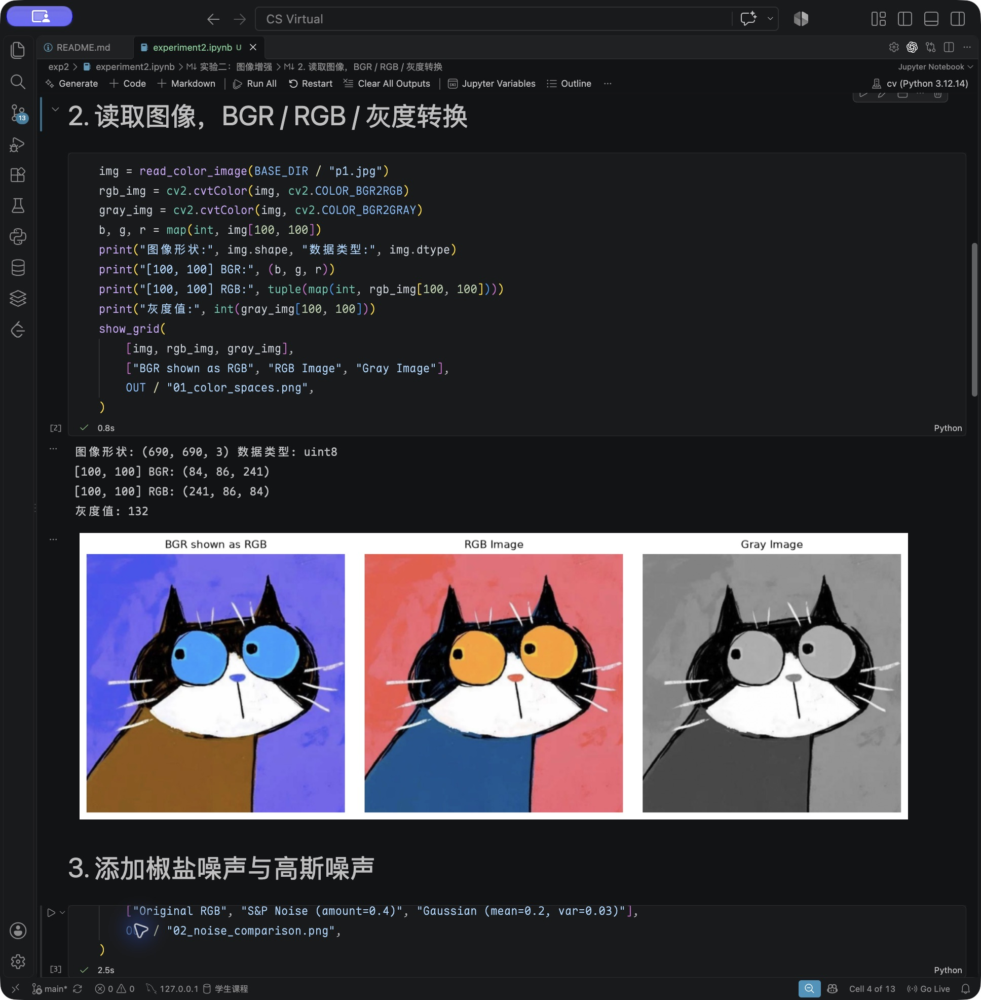
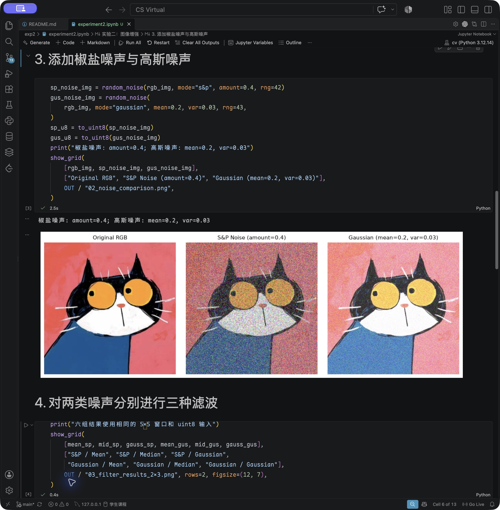
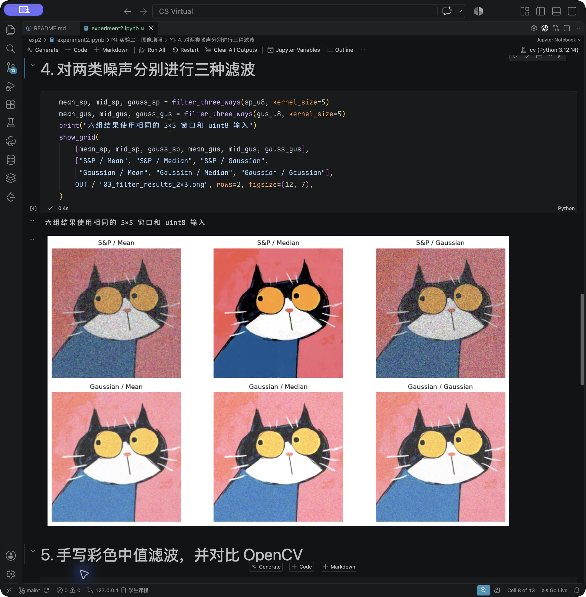
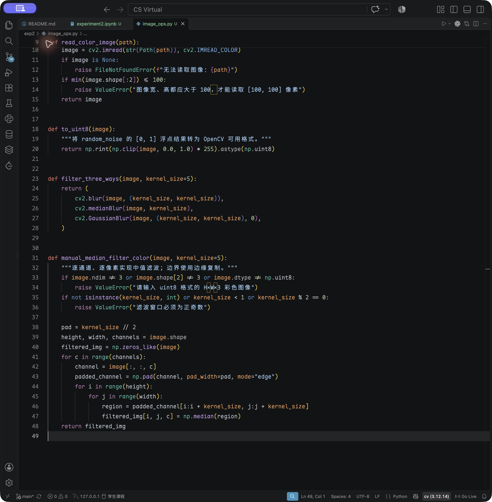
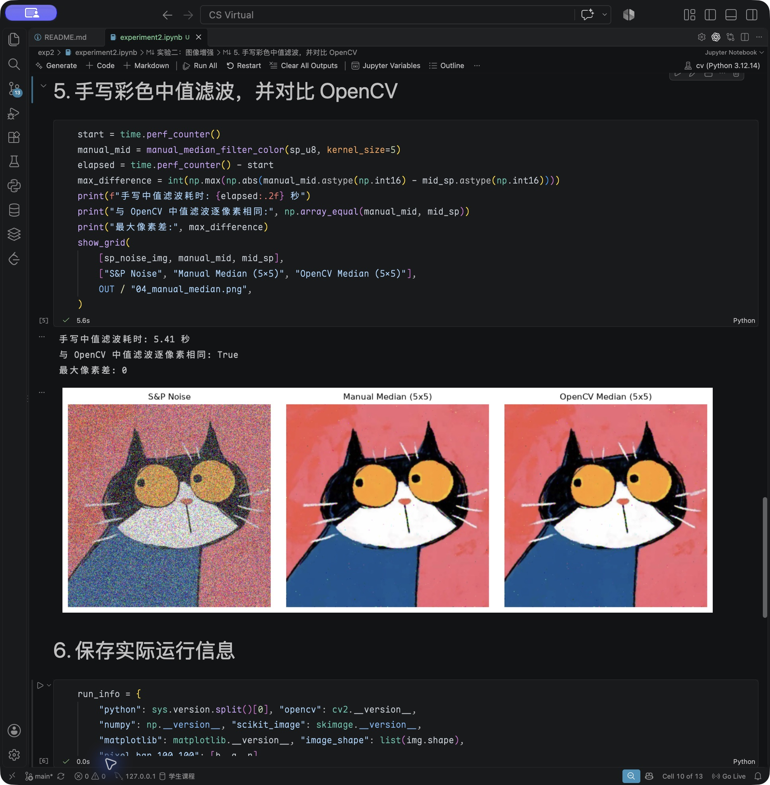

# 实验二：图像增强

## 一、实验目的

1. 学习使用 OpenCV 读取图像和进行颜色空间转换。
2. 了解椒盐噪声与高斯噪声的区别。
3. 使用均值、中值和高斯滤波处理图像，比较去噪效果。
4. 手动实现彩色中值滤波，理解邻域窗口和分通道处理的方法。

---

## 二、实验环境

- 操作系统：macOS，Apple Silicon
- 编辑与运行工具：VS Code、Jupyter Notebook
- 环境管理：Anaconda / Conda，沿用实验一的 `cv` 环境
- Python：3.12.14
- OpenCV：5.0.0
- NumPy：2.5.3
- scikit-image：0.26.0
- Matplotlib：3.11.2

在 VS Code 终端中激活环境并安装本次所需依赖：

```bash
conda activate cv
cd ~/"CS Virtual"/exp2
python -m pip install -r requirements.txt
```

打开 `experiment2.ipynb`，右上角选择 `cv (Python 3.12.14)`，按顺序运行，或点击 Run All。Python 文件的解释器也选择 `cv`。

本次按《实验二参考文档.pdf》完成。没有找到单独的 `p1.jpg` 原文件，因此从参考文档中的 RGB 猫图提取图像区域，去掉坐标轴和标题，缩放为 690×690 后保存为 `p1.jpg`。由于提取、缩放和 JPEG 压缩，像素值与参考文档中的示例略有差别。

---

## 三、实验内容

### 1. 导入依赖并确认环境

导入 OpenCV、NumPy、scikit-image 和 Matplotlib，打印版本及解释器路径，确认使用的是实验一的 `cv` 环境。

```python
import cv2
import numpy as np
import matplotlib.pyplot as plt
from skimage.util import random_noise
```

能够正常导入并输出版本号，环境配置成功。

**实验截图：**



---

### 2. 读取图像并进行颜色空间转换

使用 `cv2.imread` 读取图像，获取 `[100, 100]` 位置的像素，再将 BGR 转成 RGB 和灰度图。

```python
img = read_color_image(BASE_DIR / "p1.jpg")
rgb_img = cv2.cvtColor(img, cv2.COLOR_BGR2RGB)
gray_img = cv2.cvtColor(img, cv2.COLOR_BGR2GRAY)
b, g, r = map(int, img[100, 100])
```

`read_color_image` 是对 `cv2.imread` 的简单封装，用于检查文件是否读取成功。

实际输出：

```text
图像形状: (690, 690, 3) 数据类型: uint8
[100, 100] BGR: (84, 86, 241)
[100, 100] RGB: (241, 86, 84)
灰度值: 132
```

OpenCV 读入的通道顺序是 BGR，而 Matplotlib 按 RGB 显示。直接显示 BGR 数组时，红色背景变成蓝紫色；转换为 RGB 后显示正常。这是显示时通道顺序的差别。灰度图只保留亮度信息，猫的轮廓仍然比较清楚。

**实验截图：**



---

### 3. 添加椒盐噪声与高斯噪声

按参考文档设置噪声参数，固定随机种子，便于再次运行时得到相同的噪声图。

```python
sp_noise_img = random_noise(rgb_img, mode="s&p", amount=0.4, rng=42)
gus_noise_img = random_noise(
    rgb_img, mode="gaussian", mean=0.2, var=0.03, rng=43,
)
```

椒盐噪声图中出现了很多离散的噪点。本次函数对彩色图像的通道值随机置 0 或 1，因此也能看到彩色点。`amount=0.4` 表示噪声比例参数，不是保证恰好 40% 的完整 RGB 像素都变成纯黑或纯白。

高斯噪声表现为较均匀的颗粒，图像整体变亮。这是因为本次按照参考文档使用了正均值 `mean=0.2`。噪声图的浮点范围为 `[0, 1]`，用于 OpenCV 滤波前再转换为 `uint8`。

**实验截图：**



---

### 4. 使用三种滤波方法

分别对椒盐噪声和高斯噪声图进行均值、中值、高斯滤波。统一使用 5×5 窗口及 `uint8` 输入。

共用滤波函数中的主要代码为：

```python
cv2.blur(image, (kernel_size, kernel_size))
cv2.medianBlur(image, kernel_size)
cv2.GaussianBlur(image, (kernel_size, kernel_size), 0)
```

结果以两行三列显示：第一行是椒盐噪声，第二行是高斯噪声；三列依次是均值、中值、高斯滤波。

从结果看，中值滤波对椒盐噪声效果最明显，背景里的杂点少了很多，猫的外轮廓也保留得较好。均值和高斯滤波可以平滑噪点，但仍有较明显的杂色。

对于高斯噪声，均值和高斯滤波都能减轻颗粒感。均值滤波看起来更平滑，高斯滤波仍保留一些颗粒和细节。仅凭这张图不能断定高斯滤波一定最好。三种方法都没有消除正均值噪声造成的整体变亮现象。

**实验截图：**



---

### 5. 手动实现彩色中值滤波

按照参考文档，对 R、G、B 三个通道分别处理。边界采用复制边缘的方式填充，再依次取每个像素周围 5×5 区域的中值。手写函数使用循环和 `np.median`，没有调用 `cv2.medianBlur` 来代替实现。

主要处理过程如下，完整函数见 [image_ops.py](image_ops.py)：

```python
for c in range(channels):
    channel = image[:, :, c]
    padded_channel = np.pad(channel, pad_width=pad, mode="edge")
    for i in range(height):
        for j in range(width):
            region = padded_channel[i:i + kernel_size, j:j + kernel_size]
            filtered_img[i, j, c] = np.median(region)
```

**算法代码截图：**



将手写结果与 OpenCV 的 5×5 中值滤波结果进行逐像素比较。本次实际输出：

```text
手写中值滤波耗时: 5.41 秒
与 OpenCV 中值滤波逐像素相同: True
最大像素差: 0
```

从图中也可以看到两种中值滤波结果一致。手写方法容易理解，但循环较多，处理大图时耗时会增加。

**运行结果截图：**



---

## 四、实验结果

本次完成了图像读取、颜色转换、噪声添加、六组滤波及手写彩色中值滤波，Notebook 的六个代码单元均已实际运行。

| 实验内容 | 本次结果 |
|---|---|
| 图像读取 | 成功读取 690×690 的三通道图像 |
| 颜色转换 | 得到正常 RGB 图和单通道灰度图 |
| 噪声添加 | 椒盐噪点明显，高斯噪声产生颗粒和亮度偏移 |
| 图像滤波 | 中值滤波对本次椒盐噪声的效果最明显 |
| 手写中值滤波 | 与 OpenCV 结果逐像素一致，最大差为 0 |

运行生成的原始对比图保存在 `output_images/`，可以单独打开查看：

- [颜色空间对比图](output_images/01_color_spaces.png)
- [噪声对比图](output_images/02_noise_comparison.png)
- [六组滤波对比图](output_images/03_filter_results_2x3.png)
- [手写中值滤波对比图](output_images/04_manual_median.png)
- [实际运行参数与版本](output_images/run_info.json)

实验文件结构：

```text
exp2/
├── README.md
├── DEVELOPMENT.md
├── experiment2.ipynb
├── experiment2.py
├── image_ops.py
├── plotting.py
├── requirements.txt
├── p1.jpg
├── assets/              # VS Code 实际截图
└── output_images/       # 程序生成的结果图
```

完整实验代码保存在 [experiment2.ipynb](experiment2.ipynb)，也可以在 `cv` 环境中运行脚本：

```bash
python experiment2.py
```

脚本显示每组图后关闭图窗，即可继续下一步。需要一次运行并保存全部图片时，可以使用：

```bash
MPLBACKEND=Agg python experiment2.py
```

---

## 五、实验总结

这次实验让我熟悉了图像从读取、添加噪声到滤波的基本流程。BGR 和 RGB 的顺序很容易弄混，显示之前需要先确认格式；浮点噪声图用于中值滤波之前也需要转换类型。

对比后能看出，不同噪声适合的处理方式不同。中值滤波能较好去除本次椒盐噪声，均值和高斯滤波则能平滑高斯噪声，但也会影响细节。手动写一遍中值滤波后，对滑动窗口、边界填充以及彩色图像分通道处理有了更直观的理解。
